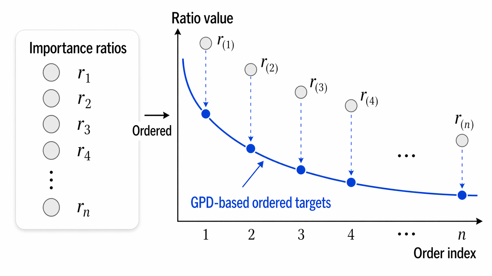

# Ordered Policy Optimization (OPO)

## 🏆 Accepted at NeurIPS 2026.

> ***Beyond fixed clipping: adaptive tail control for proximal policy optimization.***

Ordered Policy Optimization (OPO) is a simple modification of PPO that replaces a single fixed clipping range with adaptive control of extreme importance ratios for each sample.

The key observation is that policy update instability is driven primarily by the tails of the importance ratio distribution, rather than by whether each individual ratio lies inside a prescribed clipping interval. OPO therefore sorts the importance ratios within each minibatch, identifies the empirical upper and lower tails, and assigns adaptive proximal targets to the extreme samples according to a prescribed tail profile.

This yields a policy objective based on order statistics that remains fully first order and requires only minibatch sorting and a modified policy loss. In particular, OPO does not require second order optimization or additional networks, making it easy to integrate into existing PPO implementations.

[](./assets/OPO_diagram.pdf)

Training code is provided for [MuJoCo](./mujoco/) and [Atari](./atari/).

## Installation

```bash
conda create -y -n opo-mujoco python=3.10 pip
conda run -n opo-mujoco pip install -r mujoco/requirements.txt
```

```bash
conda create -y -n opo-atari python=3.10 pip
conda run -n opo-atari pip install -r atari/requirements.txt
```

## Run

Run all six MuJoCo environments with seeds 1, 2, and 3:

```bash
(cd mujoco && conda run -n opo-mujoco python main.py)
```

Run a single environment and seed:

```bash
(cd mujoco && conda run -n opo-mujoco python main.py --envs Humanoid-v4 --seeds 1)
```

```bash
(cd atari && conda run -n opo-atari python main.py --envs RoadRunner --seeds 1)
```
